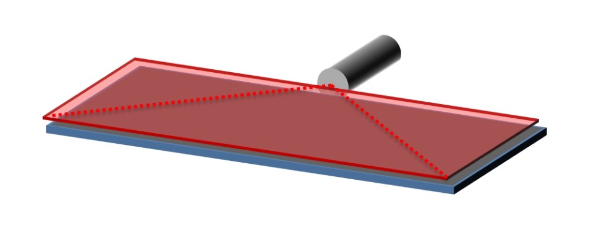
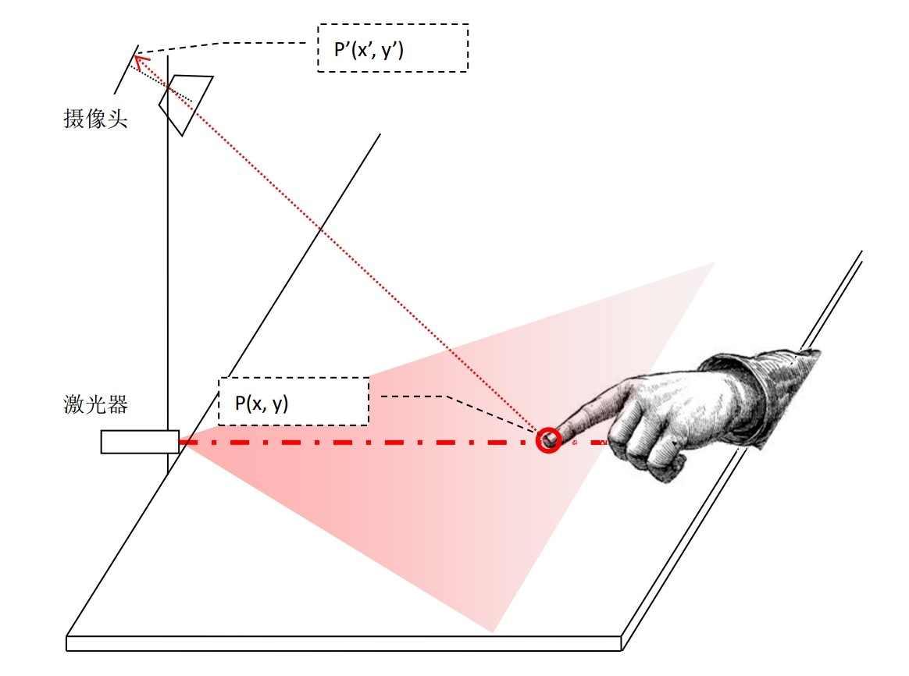
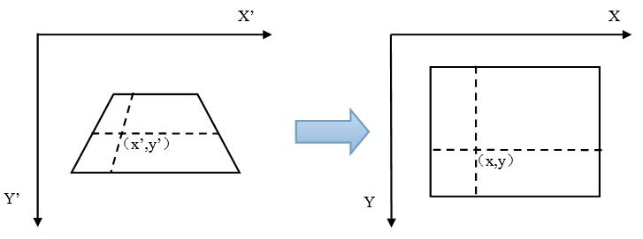
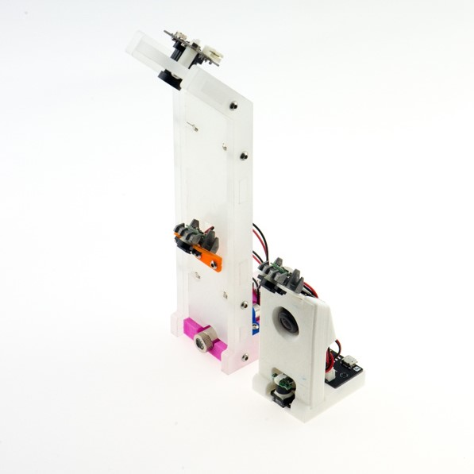
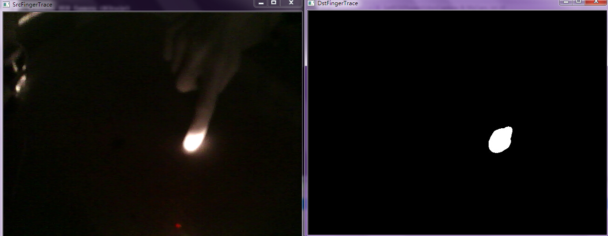
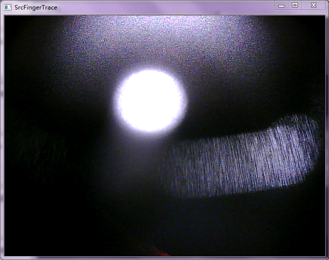
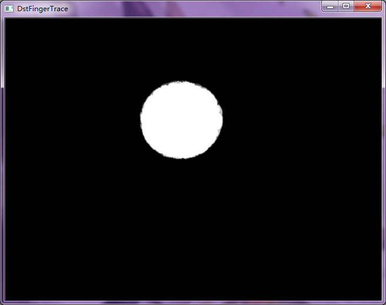
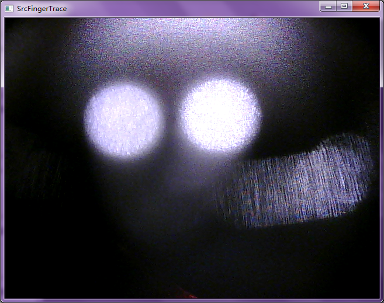
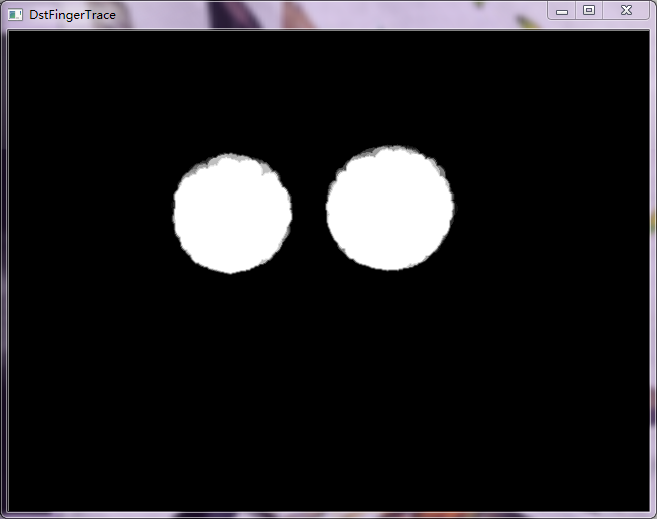

通过激光投射与红外摄像头动态捕手指尖的位置，通过数字图像处理分析指尖的运动状态，实现多点触控、手势控制，其中，数字图像采用了OpenCV开源视觉库进行处理。

##原理
1. 项目中主要的感应设备就是激光和红外摄像头。如图1所示，假设我们的激光器水平的扫过一个平面，当手指接触到这个平面后，在红外摄像头中可以看到激光在手指上留下的光斑。如果手指在图像中的坐标是P’(x’ , y’ )，通过角度换算可得手指在实际平面的位置P(x, y),如图2所示。获得之间坐标后，就可以通过计算分析其相应的运动和响应了。

图1

图2

2. 然后采用透视变换将平面控制区域映射到电脑桌面，从而实现一些简单的控制操作，如图3所示。

图3

##效果图

###实物图

实物图

[http://www.robopeak.com/](http://www.robopeak.com/)

###程序运行截图

运行截图

运行截图

运行截图

运行截图

运行截图

###实现的动作
程序通过手指来模拟一些鼠标、键盘操作，以实现的操作有：
左键单双击，右键单击，上下左右，缩放等，具体描述见下图。
